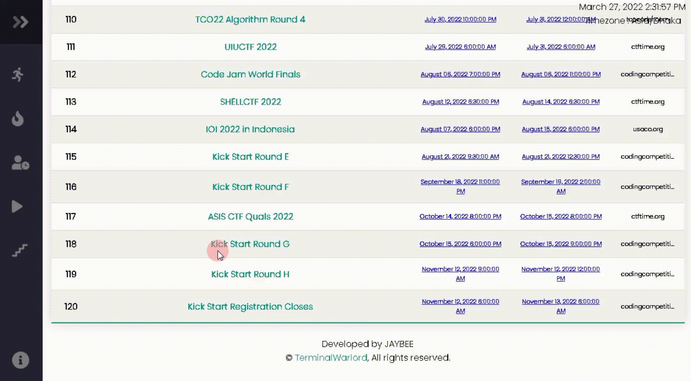
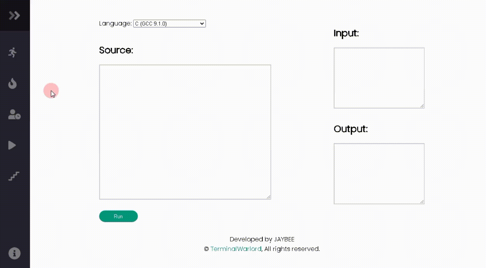

# CP Contests

### A website for Competitive Programmers with contest updates, Online IDE, Ladder and much more.

### Contest Updates
 

 * Get list of all the running and upcoming contests
 * Timezone is automatically adjusted according to your location.

### Performance of Recent Codeforces Contests
 

 * Analyze your performances on CF contests
 * Analyze problems solved by user, tags, rating and so on. 

### Online IDE
 

 * Compile and run your code online.
 * Languages supported are : `C`, `C++`, `Python2`, `Python3`, `PHP`, `GO`, `Perl`, `Ruby`, `Scala` and `Node.JS`

### CodeForces Ladder
 

 * Find top 50 problems on a spefic rating. 
 * Status column indicates if the user has solved a problem or not.

### Show some :heart: and :star: the repo to support the project

 

---
### Star the Repo if you find it useful :heart:
### © [JayBee](https://t.me/JayBeeBots)
#### All Rights Reserved
---